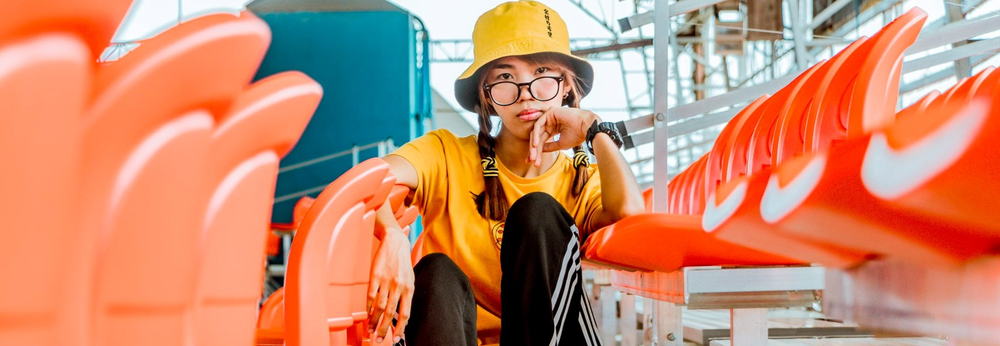

<h1 align="center">Hi there I'm Kate fross Saramosing </h1>

<h1 align="center">CURRICULUM VITAE 
</h1>

I'm currently a fourth year student taking information technology in Jose Maria College. very willing to learn new skills about multimedia and evolving technology.
my current hobbies is photography , cosplaying , photo editing and making journal stationary.

<h1 align="center">Personal Information </h1>

<p1>  

- Full name : Kate fross Saramosing  
   
- Civil Status:Single
   
- Age : 22 years old
   
- Phone: +639260958626 
   
- Height : 5'7     
   
- Website: Katefross.github.io
   
- Birth place : Davao City  
   
- Email : Katefross.saramosing@jmc.edu.ph </p1>

<h1 align="center">Education </h1>

### College: Jose Maria College 

### Senior School:  Francisco Bangoy Senio High Shool
   
  - ICT OJT in SSS Bajada completed 480 hours (2016-2017)
  
  - Completed TESDA ICT Assesment (2016-2017)

### Secondary school: Francisco Bangoy National highschool

# SKILLS

- Microsoft Office Proficiency
- Photo/Video Manipulation and Editing
- Computer Hardware and Software Maintenance
- Basic Programming (C, C++, C#, Java, Python, JavaScript, HTML5/CSS)
- Basic Data entry
- Basic lightroom editing and photoshop 
- 

Check out my curriculum vitae doctument here [CURRICULUM VITAE](https://github.com/katefross/katefross.github.io/blob/main/JMC%20ITE%20Practicum%20Curriculum%20Vitae%20Sample.docx).

# About me
 very willing to learn new skills about multimedia and evolving technology. my current hobbies is photography , cosplaying , photo editing and making journal stationary

<h1 align="center"> Hobbies </h1>

# Photography

I started Photography since 2018 i only use mobilephone that time because camera where so expensive unlike today it can be installment or lay away method.im getting interested and want to learn new skills through photography and that's why i save some of my allowance and bought a camera. my very first camera is Nikon 3500D and Upgraded to Canon and last 2021 i upgrade to Sony A6000. im really thankful for those people who trusted me in my work and hopefully will upgrade soon.

for more details check my facebook page [Kiokophotography](https://web.facebook.com/KiokuMemorys?_rdc=1&_rdr)

# Cosplay

Since 2014 i joined Cosplay community in Davao city it was fullfilling to recreate some of my favorate characters and give life 

# Travel 

### Mount Fuji and  Imperial Tokyo

- this are is my dream travel aside from wanting to travel localy this is also my dream to visit japan and visit some of the most  majestic place like the mount Fuji and Imperial tokyo 

# Certificate 

   Check out my Certificate here [Certificate](https://drive.google.com/drive/folders/1Oxi8XyjSCLsEch0y9IEYK6GmG3VC_jz8?usp=sharing)
   
 # SOCIAL MEDIA  LINKS
 
 YOUTUBE CHANNEL [kATTIE VLOGS ](https://www.youtube.com/channel/UC3sjEZ37NJl3_Kn23JCtOMA/about) and [PANDA3](https://www.youtube.com/channel/UCFN-gUUWEFcWw8OkS9Ya_iQ)
 
  
